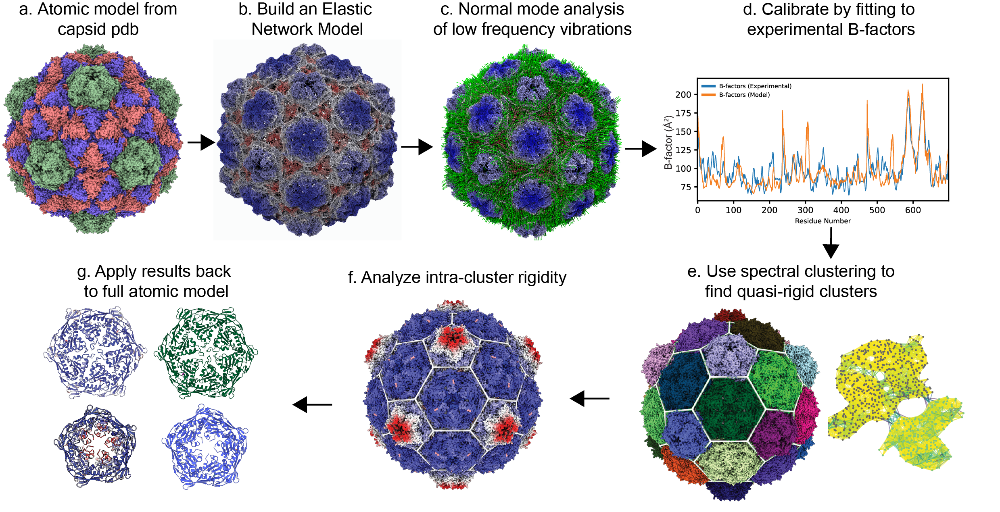

# pyCapsid

## Description
pyCapsid is a Python package that identifies dominant motions, rigid domains, and disassembly units of protein shells (and other macromolecular complexes), combining elastic network models and clustering methods. The input of pyCapsid is a molecular structure from the Protein Data Bank (PDBid) or in PDB format. The output of pyCapsid includes a report that includes key analyses and figures. 

The quickest way to use pyCapsid is as a [Google Colab notebook](https://colab.research.google.com/github/luquelab/pyCapsid/blob/main/notebooks/pyCapsid_colab_notebook.ipynb) in the cloud. It only requires a Google account and can analyze from small to medium capsids. For the analysis of larger capsids or high-throughput studies, it is recommended to install pyCapsid from the Python repositories [PIP](https://pypi.org/project/pyCapsid/) or [Conda](https://anaconda.org/luque_lab/pycapsid).

The methodology and application of pyCapsid were recently peer-reviewed and published in Bioinformatics by Oxford Academic:
+ Brown, Colin, Anuradha Agarwal, and Antoni Luque. "pyCapsid: Identifying dominant dynamics and quasi-rigid mechanical units in protein shells." *Bioinformatics*, 40(1), btad761, **2024**. <https://doi.org/10.1093/bioinformatics/btad761>

Below, we provide a basic description of the package and repository. We recommend visiting the [pyCapsid's online documentation](https://luquelab.github.io/pyCapsid/) for a more detailed guide to using pyCapsid.

pyCapsid is under an MIT license. If you use pyCapsid on any scientific or scholarly work, please cite the above reference to support this academic and open-source initiative from the [Luque lab](https://luquelab.github.io/website).

**Figure: pyCapsid's key steps**. a) The protein shell (atom coordinates, atom types, and B-factors) is inputted using a PDB file (or a PDB ID). (b) The elastic network model (ENM) is calibrated (parametrized). (c) Normal mode analysis (NMA) determines the distance fluctuations between residues. (d) The correlation coefficient of predicted and experimental B-factors is generated for quality control. (e) Spectral clustering is applied to obtain the quasi-rigid molecular domains in the capsid. (f) The fluctuations between residues within the rigid clusters are calculated. (g) The results are mapped back to the capsid protein atomic model for structural interpretation. 

## Installation
The package requires Python>3.7 and < 3.11; we recommend Python 3.10.
Via pip:
~~~~
pip install pyCapsid
~~~~

Via conda: 
~~~~
conda install -c luque_lab -c conda-forge pycapsid
~~~~

## Documentation
pyCapsid's documentation is available as a GitHub-pages website accessible at <https://luquelab.github.io/pyCapsid/>. The documentation's source files are located in this repository at <https://github.com/luquelab/pyCapsid/tree/main/docs>.

## Examples and Tutorials
The online [Colab notebook](https://colab.research.google.com/github/luquelab/pyCapsid/blob/main/notebooks/pyCapsid_colab_notebook.ipynb) contains a default example in the Quick-start guide, which is the simplest way to get started using pyCapsid.

An example of the pyCapsid report is accessible at <https://github.com/luquelab/pyCapsid/tree/main/notebooks/pyCapsid_report_example>.

The online documentation includes a page with [tutorials](https://luquelab.github.io/pyCapsid/tutorial/).

The [pyCapsid YouTube playlist](https://www.youtube.com/playlist?list=PLoqX8Gr-Q1jaDwF8phzP2MfVsMw71IdOt) includes video tutorials with instructions on using the Colab notebook and visualizing the results in ChimeraX.

## Online repositories
pyCapsid is available as a GitHub repository at <https://github.com/luquelab/pyCapsid> and in Zenodo at the permanent [DOI 10.5281/zenodo.8408578](https://zenodo.org/doi/10.5281/zenodo.8408578). 

## Project history
This is an evolving repository:
+ Started: 2022-10-24
+ Ended: Ongoing

## Folder's content

+ `/bin`: Basic scripts and executable files.
+ `/conda`: Files needed to deploy in Conda's repository.
+ `/data`: Raw data associated with the project and the potential references.
+ `/docs`: This folder contains the project's documentation.
+ `/notebooks`: Notebooks associated with the project.
+ `/results`: This folder contains the results, performance analysis, and commented references associated with the project.
+ `/src/pyCapsid`: Package's source codes.

