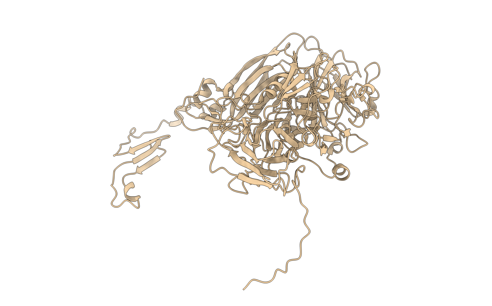
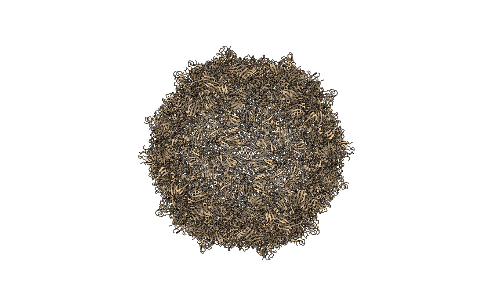
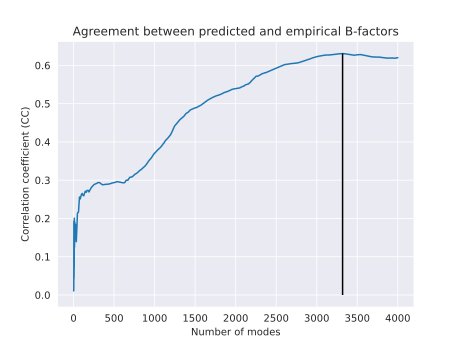
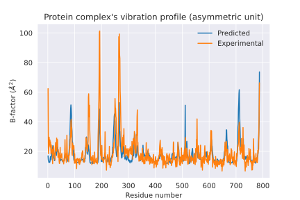
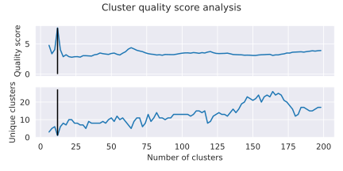
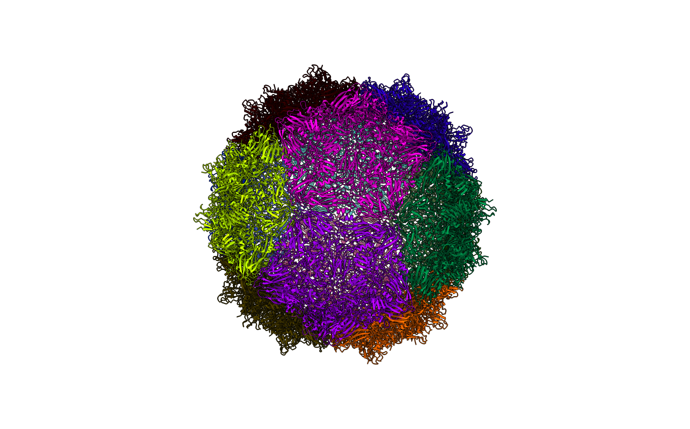
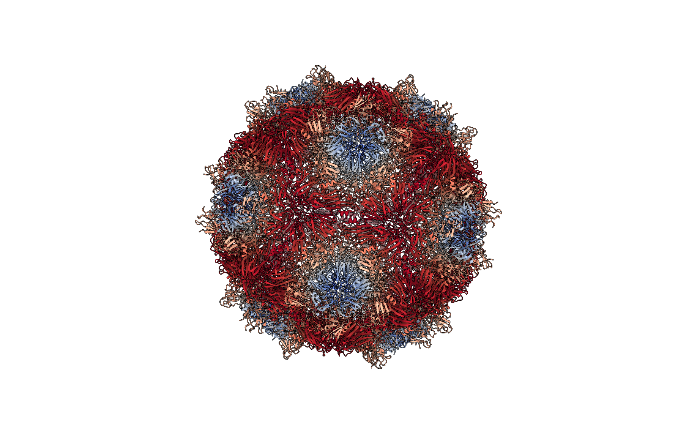

# pyCapsid Report
August 23, 2023

## Input structure
Identifier: 3nap

Number of residues in the asymmetric unit: 787

Number of protein chains in the asymmetric unit: 3

Multiplying factor to generate the complete protein complex: 60

+ If the multiplying factor is one (*m = 1*), the protein complex and the asymmetric unit are the same.

+ If the multiplying factor is larger than one (*m > 1*), the protein complex is *m* times the asymmetric unit.

Number of residues in the protein complex: 47220

Number of protein chains in the protein complex: 180

***

**Figure: Asymmetric unit** (below). Ribbon diagram of the protein complex's asymmetric unit.

***

**Figure: Full protein complex** (below). Ribbon diagram of the full protein complex.

***

## Elastic network model

Elastic model used: U-ENM

Calibrated stiffness constant (gamma): 0.29

+ This constant was fitted to scale the model to the structure, assuming a linear relationship between the residues fluctuations and B-factors.

***

**Figure: Model calibration** (below). The empirical B-factors are plotted against the predicted fluctuations. A regression line was fitted. From the slope (a), the calibration constant (gamma) was obtained using the formula: *gamma = (8(pi)^2)/(3a)*.

## Normal mode analysis (NMA)

Optimal number of modes reproducing B-factors: 1199

Correlation between empirical and predicted B-factors: 0.42

***

**Figure: Selection of the best number of modes** (below). Correlation coefficient obtained comparing the experimental B-factors with respect the B-factors predicted an increasing number of low frequency modes. The black line higlights the number of modes that yield the optimal correlation coefficient with the empirical B-factors.

**Figure: Correlation of B-factors** (below). Empirical (blue) and predicted (orange) B-factors for each residue in the asymmetric unit.

***

## Quasi-rigid mechanical units

Number of optimal quasi-rigid mechanical units identified: 12

**Figure: Optimal clustering selection** (below). Quality score (top) and number of unique clusters (bottom) obtained as a function of the number of clusters tested. The black lines in each plot higlight the quality score and number of unique clusters for the optimal number of clusters identified.

***

**Figure: Quasi-rigid clusters** (below). Ribbon representation of the complete structure, with each residue colored according to its cluster membership. Residues with the same color are members of the same quasi-rigid cluster.

**Figure: Residue cluster quality score** (below). Ribbon representation of the complete structure, with each residue colored according to its cluster quality score.  This is a measure of how rigid each residue is with respect to its cluster. Blue residues make up the cores of rigid clusters, and red residues represent borders between clusters.

# Missing images in the report? 
 

To render the missing images locally using ChimeraX, check the 'chimerax' folder of the report, and follow the instructions provided in the readme file. This will automatically place the images in the .md and .html versions. For the word document, copy and paste the relevant images directly into the document.

If you were visualizing the results using NGLView, you should have several images downloaded corresponding to the relevant images. After extracting "pyCapsid_report.zip", place the corresponding images from your download folder into "pyCapsid_report/figures/structures/" replacing the empty images in that folder. This will fix the issue for the .md and .html versions. For the word document, copy and paste the relevant images directly into the document.