# Results Gallery

## Results from the application of pyCapsid to a set of HK97-fold protein shells. 
Data covering the application of pyCapsid to this set of HK97-fold protein shells is provided [here.](https://github.com/luquelab/pyCapsid/blob/main/results/pyCapsid_hk97_data_cbrown_thesis.csv)

{: width="1800"}

## Successful prediction of disassembly units

### Seneca Valley Virus (PDBID: [3cji](https://doi.org/10.2210/pdb3CJI/pdb))

pyCapsid’s b-factor predictions have a correlation coefficient of 0.64 with the experimental b-factors at 800 modes. 
pyCapsid identifies the rigid clusters as 12 pentons, each containing 15 MCPs. Experiments have identified that the 
procapsid of the virus dissociates into pentamers, matching our prediction. [[1]](https://doi.org/10.1128/jvi.01927-17)

[Full pyCapsid Report](https://luquelab.github.io/pyCapsid/gallery/3cji_pyCapsid_report/pyCapsid_report.html)

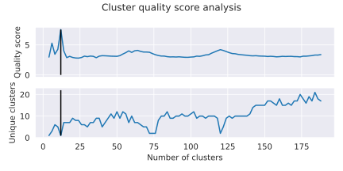
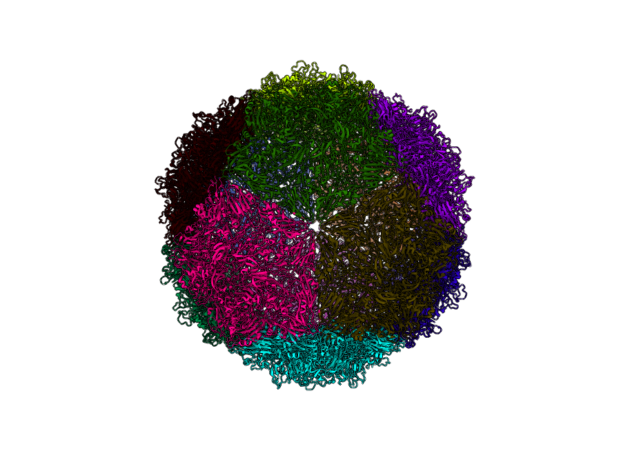

### Triatoma Virus (PDBID: [3nap](https://doi.org/10.2210/pdb3NAP/pdb))

pyCapsid’s b-factor predictions have a correlation coefficient of 0.42 with the experimental b-factors at 1200 modes. 
pyCapsid identifies the rigid clusters as 12 pentons, each containing 15 MCPs. Both experiments and molecular dynamics 
simulations have been applied to explore the disassembly of this capsid, and both identify the pentons as the disassembly
unit, matching our prediction. [[2]](https://doi.org/10.1371/journal.pcbi.1006082) [[3]](https://doi.org/10.1099/vir.0.048553-0)
Both picornaviruses have similar disassembly units.

[Full pyCapsid Report](https://luquelab.github.io/pyCapsid/gallery/3nap_pyCapsid_report/pyCapsid_report.html)

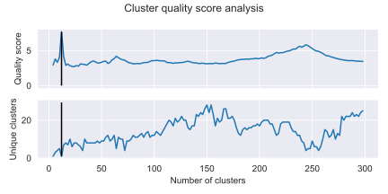
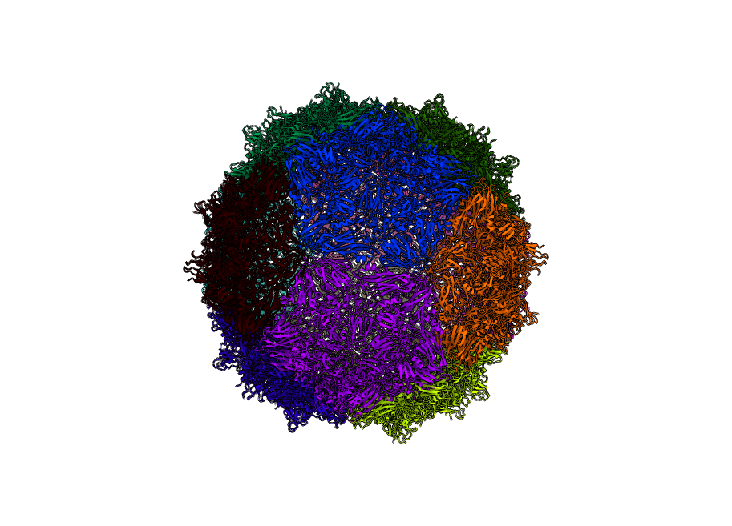

### Bacteriophage MS2 (PDBID: [2ms2](https://doi.org/10.2210/pdb2MS2/pdb))

pyCapsid’s b-factor predictions have a correlation coefficient of 0.66 with the experimental b-factors at 800 modes. 
pyCapsid identifies the rigid clusters as 90 dimers, each containing 2 MCPs. This matches observations from NMR experiments
that the capsid dissociates into dimers. [[4]](https://doi.org/10.1016%2FS0006-3495(03)75117-0) 

[Full pyCapsid Report](https://luquelab.github.io/pyCapsid/gallery/2ms2_pyCapsid_report/pyCapsid_report.html)

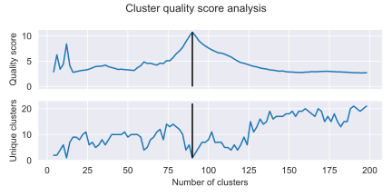
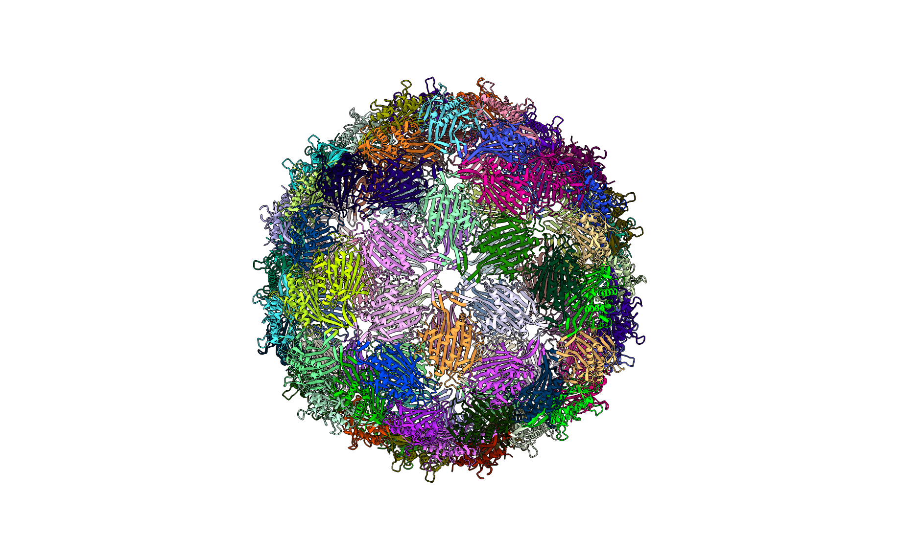

### Hepatitis B Virus (PDBID: [2g33](https://doi.org/10.2210/pdb2G33/pdb))

pyCapsid’s b-factor predictions have a correlation coefficient of 0.57 with the experimental b-factors at 800 modes. 
pyCapsid identifies the rigid clusters as 120 dimers, each containing 2 MCPs. Both spectroscopy experiments and 
molecular dynamics simulations have been applied to explore the disassembly of this capsid, and both identify the dimers
as the disassembly unit matching our prediction. [[5]](https://doi.org/10.1021/acs.biochem.1c00810) [[6]](https://doi.org/10.1073/pnas.2102530118) 

[Full pyCapsid Report](https://luquelab.github.io/pyCapsid/gallery/2g33_pyCapsid_report/pyCapsid_report.html)

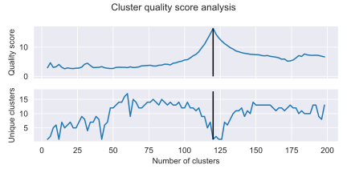
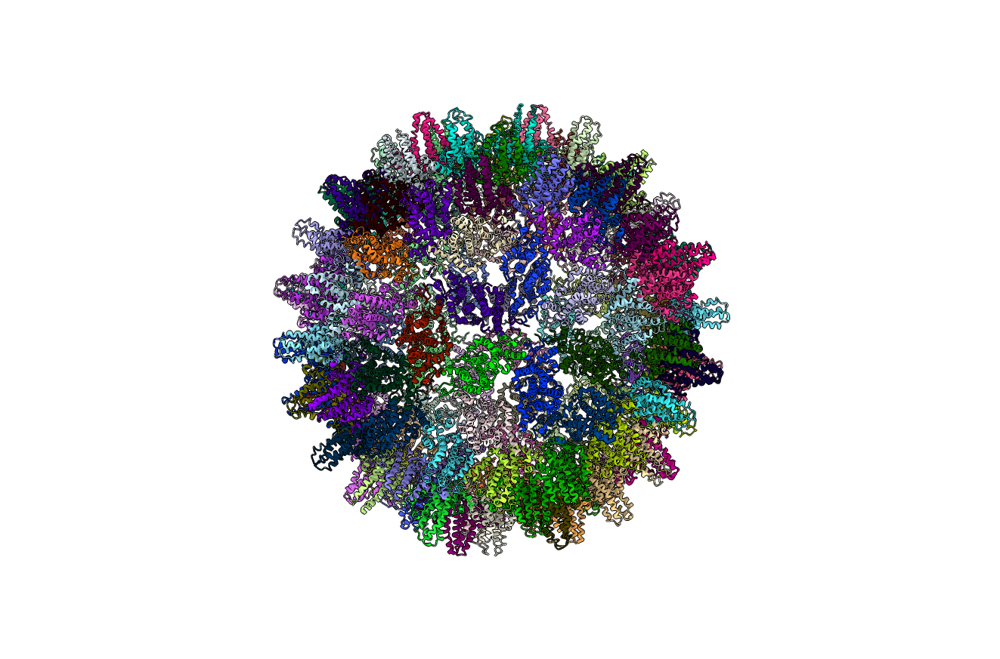

### Phage P22 (PDBID: [5uu5](https://doi.org/10.2210/pdb5UU5/pdb))

pyCapsid’s b-factor predictions have a correlation coefficient of 0.6 with the experimental b-factors at 3800 modes. 
pyCapsid identifies the rigid clusters as either 12 pentons containing 35 MCPs each or as 12 pentamers containing 5 MCPs 
each and 60 hexamers containing 6 MCPs each. These correspond to the peaks in the quality score at 12 and 72.
Heating the expanded shell of P22 has been shown to cause the pentamers to release, resulting in a “wiffle ball” 
structure. [[7]](https://doi.org/10.1016/j.bbagen.2018.03.006) This is consistent with the prediction at 72 clusters which
includes pentamers as a rigid subunit.

[Full pyCapsid Report](https://luquelab.github.io/pyCapsid/gallery/5uu5_pyCapsid_report/pyCapsid_report.html)

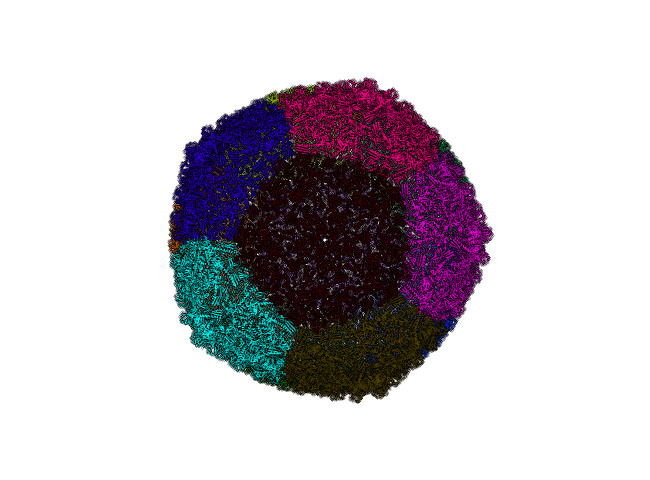
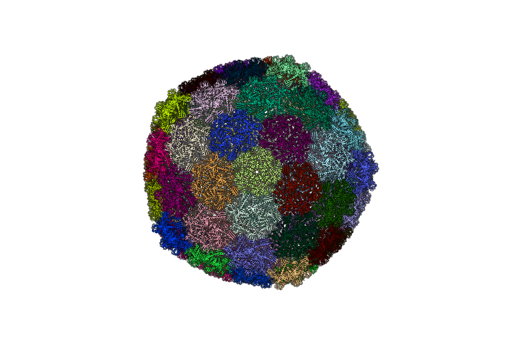

## Unsuccessful prediction of disassembly units

### Phage HK97 (PDBID: [2ft1](https://doi.org/10.2210/pdb2FT1/pdb))

pyCapsid’s b-factor predictions have a correlation coefficient of 0.55 with the experimental b-factors at 10000 modes. 
pyCapsid identifies the rigid clusters as primarily the core residues of the 420 MCPs and 64 clusters corresponding to 
small extended domains of less than 10 residues for a total of 484 clusters. HK97 has also been observed to form the 
“wiffle ball” structures as in P22. [[8]](https://doi.org/10.1016/j.jmb.2005.02.045) pyCapsid didn’t successfully predict pentameric disassembly units in this case, unlike in P22, but the prediction of individual MCPs isn’t inconsistent with pentamers.

[Full pyCapsid Report](https://luquelab.github.io/pyCapsid/gallery/2ft1_pyCapsid_report/pyCapsid_report.html)

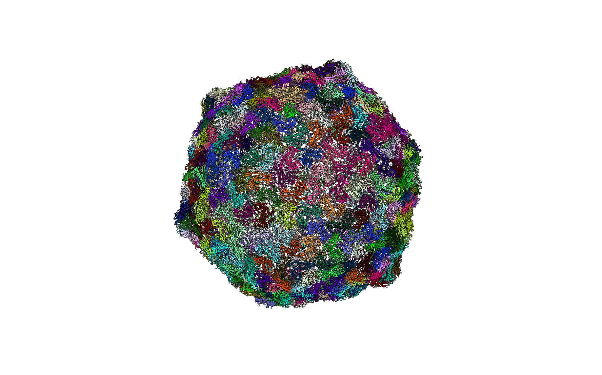

### Cowpea Chlorotic Mottle Virus (PDBID: [1za7](https://doi.org/10.2210/pdb1ZA7/pdb))

pyCapsid’s b-factor predictions have a correlation coefficient of 0.56 with the experimental b-factors at 6000 modes. 
pyCapsid identifies the rigid clusters as the 180 MCPs, one MCP per cluster. Experimental results do not support this 
and suggest that the capsid disassembles into dimeric groups. [[9]](https://doi.org/10.1016/j.jviromet.2007.07.020) This
capsid requires a large number of modes to yield accurate correlations, with a CC of only 0.08 at 800 modes. This suggests
that there may be something unique about the dynamics of the capsid that may make it more difficult for ENM/NMA methods 
describe. CCMV also undergoes a swelling transition before disassembly, and this intermediate swollen state may have 
different rigid subunits than the native state, explaning pyCapsid's incorrect disassembly prediction. [[10]](https://doi.org/10.1016/S0969-2126(01)00135-6)

[Full pyCapsid Report](https://luquelab.github.io/pyCapsid/gallery/1za7_pyCapsid_report/pyCapsid_report.html)

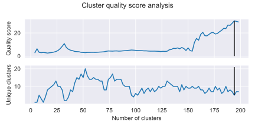
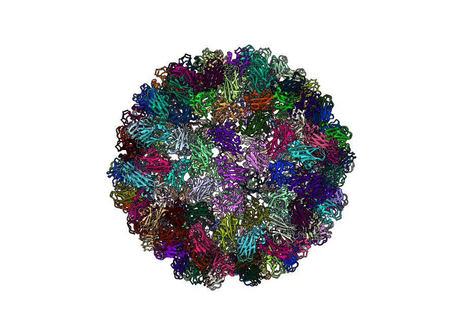

## Comparisons with previous methods

### PISQRD++
[Publication](https://doi.org/10.1371/journal.pcbi.1003331) |
[Software](https://people.sissa.it/~michelet/vircapdomains/)

### SPECTRUS
[Publication](https://doi.org/10.1016/j.str.2015.05.022) |
[Software](http://spectrus.sissa.it/)

