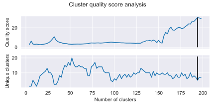
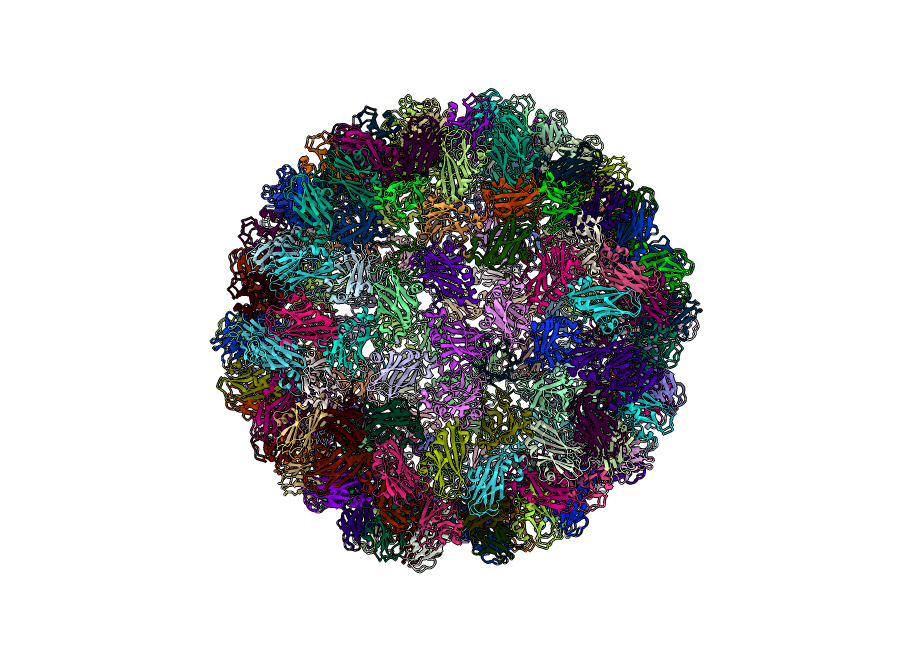

# Results Gallery

## Results from the application of pyCapsid to a set of HK97-fold protein shells. 
Data covering the application of pyCapsid to this set of HK97-fold protein shells is provided [here.](https://github.com/luquelab/pyCapsid/blob/main/results/pyCapsid_hk97_data_cbrown_thesis.csv)

{: width="1800"}

## Successful prediction of disassembly units

### Seneca Valley Virus (PDBID: 3cji)
[Full pyCapsid Report](https://luquelab.github.io/pyCapsid/gallery/3cji_pyCapsid_report/pyCapsid_report.html)

### Triatoma Virus (PDBID: 3nap)
[Full pyCapsid Report](https://luquelab.github.io/pyCapsid/gallery/3nap_pyCapsid_report/pyCapsid_report.html)

### Bacteriophage MS2 (PDBID: 2ms2)
[Full pyCapsid Report](https://luquelab.github.io/pyCapsid/gallery/2ms2_pyCapsid_report/pyCapsid_report.html)

### Hepatitis B Virus (PDBID: 2g33)
[Full pyCapsid Report](https://luquelab.github.io/pyCapsid/gallery/2g33_pyCapsid_report/pyCapsid_report.html)

### Phage P22 (PDBID: 5uu5)
[Full pyCapsid Report](https://luquelab.github.io/pyCapsid/gallery/5uu5_pyCapsid_report/pyCapsid_report.html)

## Unsuccessful prediction of disassembly units

### Cowpea Chlorotic Mottle Virus (PDBID: 1za7)
[Full pyCapsid Report](https://luquelab.github.io/pyCapsid/gallery/1za7_pyCapsid_report/pyCapsid_report.html)

## Comparisons with previous methods

### PISQRD++
[Publication](https://doi.org/10.1371/journal.pcbi.1003331) |
[Software](https://people.sissa.it/~michelet/vircapdomains/)

### SPECTRUS
[Publication](https://doi.org/10.1016/j.str.2015.05.022) |
[Software](http://spectrus.sissa.it/)

