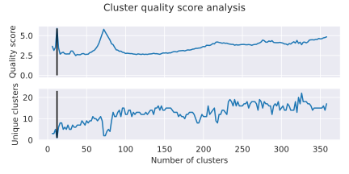

# Results Gallery

## Results from the application of pyCapsid to a set of HK97-fold protein shells. 
Data covering the application of pyCapsid to this set of HK97-fold protein shells is provided [here.](https://github.com/luquelab/pyCapsid/blob/main/results/pyCapsid_hk97_data_cbrown_thesis.csv)

{: width="1800"}

## Successful prediction of disassembly units

### Seneca Valley Virus (PDBID: [3cji](https://doi.org/10.2210/pdb3CJI/pdb))

pyCapsid’s b-factor predictions have a correlation coefficient of 0.64 with the experimental b-factors at 800 modes. 
pyCapsid identifies the rigid clusters as 12 pentons, each containing 15 MCPs. Experiments have identified that the 
procapsid of the virus dissociates into pentamers, matching our prediction. [[1]](https://doi.org/10.1128/jvi.01927-17)

[Full pyCapsid Report](https://luquelab.github.io/pyCapsid/gallery/3cji_pyCapsid_report/pyCapsid_report.html)

### Triatoma Virus (PDBID: [3nap](https://doi.org/10.2210/pdb3NAP/pdb))

pyCapsid’s b-factor predictions have a correlation coefficient of 0.42 with the experimental b-factors at 1200 modes. 
pyCapsid identifies the rigid clusters as 12 pentons, each containing 15 MCPs. Both experiments and molecular dynamics 
simulations have been applied to explore the disassembly of this capsid, and both identify the pentons as the disassembly
unit, matching our prediction. [[2]](https://doi.org/10.1371/journal.pcbi.1006082) [[3]](https://doi.org/10.1099/vir.0.048553-0)
Both picornaviruses have similar disassembly units.

[Full pyCapsid Report](https://luquelab.github.io/pyCapsid/gallery/3nap_pyCapsid_report/pyCapsid_report.html)

### Bacteriophage MS2 (PDBID: [2ms2](https://doi.org/10.2210/pdb2MS2/pdb))

pyCapsid’s b-factor predictions have a correlation coefficient of 0.66 with the experimental b-factors at 800 modes. 
pyCapsid identifies the rigid clusters as 90 dimers, each containing 2 MCPs. This matches observations from NMR experiments
that the capsid dissociates into dimers. [[4]](https://doi.org/10.1016%2FS0006-3495(03)75117-0) 

[Full pyCapsid Report](https://luquelab.github.io/pyCapsid/gallery/2ms2_pyCapsid_report/pyCapsid_report.html)

### Hepatitis B Virus (PDBID: [2g33](https://doi.org/10.2210/pdb2G33/pdb))

pyCapsid’s b-factor predictions have a correlation coefficient of 0.57 with the experimental b-factors at 800 modes. 
pyCapsid identifies the rigid clusters as 120 dimers, each containing 2 MCPs. Both spectroscopy experiments and 
molecular dynamics simulations have been applied to explore the disassembly of this capsid, and both identify the dimers
as the disassembly unit matching our prediction. [[5]](https://doi.org/10.1021/acs.biochem.1c00810) [[6]](https://doi.org/10.1073/pnas.2102530118) 

[Full pyCapsid Report](https://luquelab.github.io/pyCapsid/gallery/2g33_pyCapsid_report/pyCapsid_report.html)

### Phage P22 (PDBID: [5uu5](https://doi.org/10.2210/pdb5UU5/pdb))

pyCapsid’s b-factor predictions have a correlation coefficient of 0.6 with the experimental b-factors at 3800 modes. 
pyCapsid identifies the rigid clusters as 12 pentamers containing 5 MCPs each and 60 hexamers containing 6 MCPs each. 
Heating the expanded shell of P22 has been shown to cause the pentamers to release, resulting in a “wiffle ball” 
structure. [[7]](https://doi.org/10.1016/j.bbagen.2018.03.006) This is consistent with our prediction of the pentamers as a 
disassembly unit.

[Full pyCapsid Report](https://luquelab.github.io/pyCapsid/gallery/5uu5_pyCapsid_report/pyCapsid_report.html)

## Unsuccessful prediction of disassembly units

### Cowpea Chlorotic Mottle Virus (PDBID: [1za7](https://doi.org/10.2210/pdb1ZA7/pdb))

pyCapsid’s b-factor predictions have a correlation coefficient of 0.08 with the experimental b-factors at 800 modes. 
pyCapsid identifies the rigid clusters as the 180 MCPs, one MCP per cluster. Experimental results do not support this 
and suggest that the capsid disassembles into dimeric groups. [[8]](https://doi.org/10.1016/j.jviromet.2007.07.020) The low 
correlation coefficient indicates that pyCapsid, with its default settings, doesn’t effectively describe the dynamics of
the capsid and thus wouldn’t accurately predict disassembly units. CCMV also undergoes a swelling transition before 
disassembly, and this intermediate swollen state may have different rigid subunits than the native state. [[9]](https://doi.org/10.1016/S0969-2126(01)00135-6)

[Full pyCapsid Report](https://luquelab.github.io/pyCapsid/gallery/1za7_pyCapsid_report/pyCapsid_report.html)

## Comparisons with previous methods

### PISQRD++
[Publication](https://doi.org/10.1371/journal.pcbi.1003331) |
[Software](https://people.sissa.it/~michelet/vircapdomains/)

### SPECTRUS
[Publication](https://doi.org/10.1016/j.str.2015.05.022) |
[Software](http://spectrus.sissa.it/)

