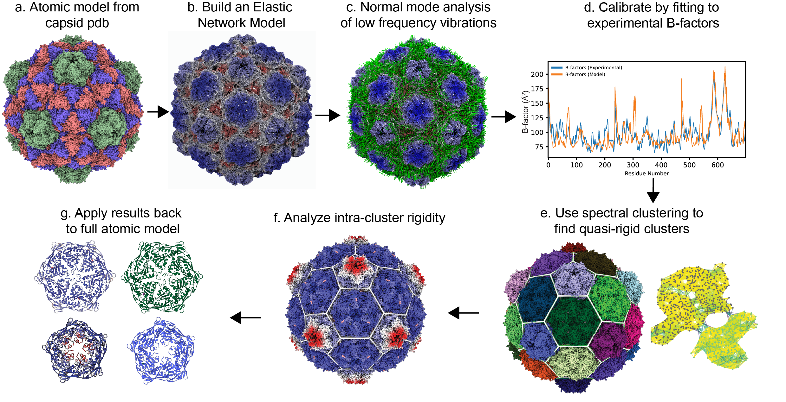

# pyCapsid Documentation

[pyCapsid](https://github.com/luquelab/pyCapsid) is a high-performance Python package for analyzing protein shells and other protein complexes. Given a molecular model in [PDB format](https://pdb101.rcsb.org/learn/guide-to-understanding-pdb-data/introduction), it identifies the dominant dynamics and quasi-rigid mechanical units in the structure. The figure displayed below and [Gallery page](https://luquelab.github.io/pyCapsid/gallery/) illustrate the main steps of the analysis and standard outputs. The results from pyCapsid have been generated having in mind the visualization software [NGLView](http://nglviewer.org/nglview/latest/) and [ChimeraX](https://www.cgl.ucsf.edu/chimerax/), but they can be visualized in other platforms too. The package is available on [GitHub](https://github.com/luquelab/pyCapsid), [PIP](https://pypi.org/project/pyCapsid/), and [Conda](https://anaconda.org/luque_lab/pycapsid), and the package installation steps are described in the [Installation page](https://luquelab.github.io/pyCapsid/installation/). The [Tutorial page](https://luquelab.github.io/pyCapsid/tutorial/) shows how to input, analyze, and visualize structures with pyCapsid.

The analysis applies coarse-grained elastic network models in conjunction with normal mode analysis to simulate the motions of large 
protein complexes. The methods have been optimized to provide a significant average gain in speed compared to popular protein dynamic packages like [ProDy](http://prody.csb.pitt.edu/). A critical analysis in pyCapsid is the quasi-rigid domain decomposition, which builds on the [Spectrus algorithm](http://spectrus.sissa.it). pyCapsid was inspired by the seminal work of many researchers that have pioneered new geometrical and computational methods to analyze protein shells, particularly in the study of viral capsids, for example, applying [elastic network models](https://doi.org/10.1016/j.jmb.2004.10.054), [quasi-rigid units](https://doi.org/10.1371/journal.pcbi.1003331), [geometry](https://doi.org/10.1038/s41467-019-12367-3), and [viral phrenology](https://doi.org/10.3390/v13112191) to investigate protein shells.

If publishing or disseminating work using pyCapsid, please follow the citation details provided in the [Acknowledgements page](https://luquelab.github.io/pyCapsid/acknowledgements/) to give credit to the authors involved.

{: width="800"; style="display:block; margin-left:auto; margin-right:auto"}

## Project History
This is an evolving repository
Started: 2022-10-24
