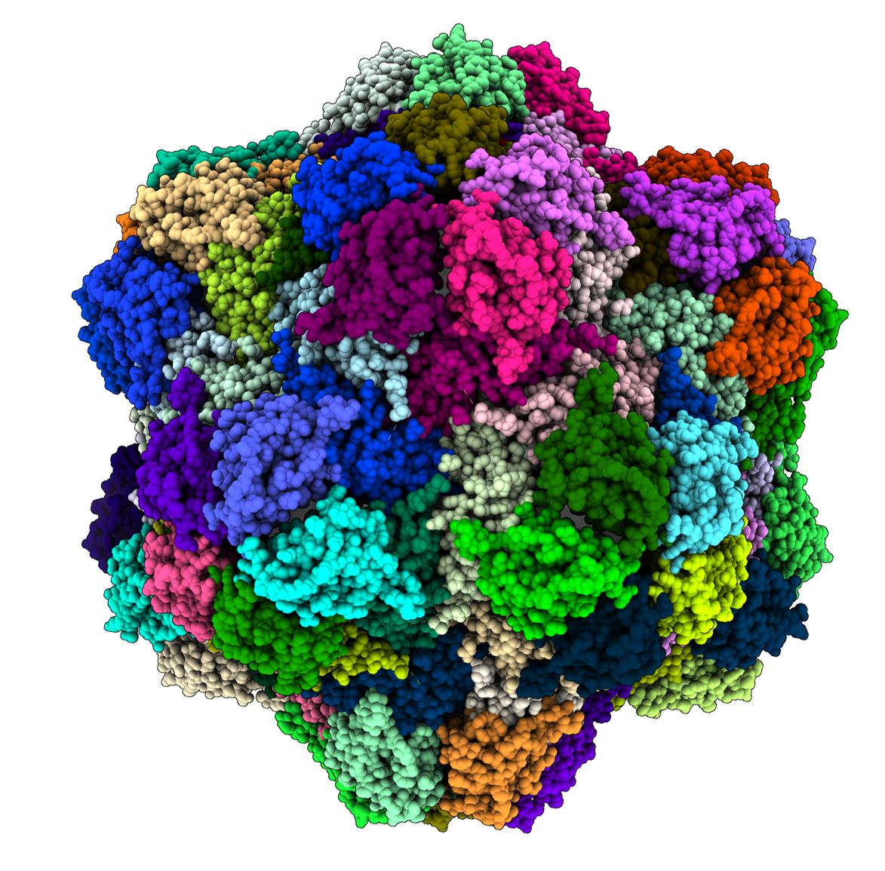

# Home

## pyCapsid: Classifying Viral Capsids via Quasi-Rigid Domain Decomposition

=======
## Home

**People.** The first principle in the lab is people. Projects occur because people think and work on them. Share here some basic information about the team involved in the project. Use hyperlinks as needed. Add a picture of you or the team. Introduce yourself and any bio that you consider relevant. Mention the other members involved. Here is an example. Welcome to the documentation of the [project_template](https://github.com/luquelab/project_template/tree/main/docs) GitHub repository! My name is Antoni Luque, and I am leading this project. I'm an Associated Professor in the [Mathematics & Statistics Department](https://math.sdsu.edu) at San Diego State University ([SDSU](https://www.sdsu.edu)) If you have any questions you can contact me at my SDSU email: [aluque@sdsu.edu].

**What.** This project is a template for projects in my [lab](https://www.luquelab.com).

**Why.** Research projects usually get shaped to be published in articles. This project template is part of an initiative to make research more accessible to the general and specialized public, from the beginning of a project.

**How.** The documentation is generated using Jekyll and GitHub Pages from the docs/ folder in the GitHub repo associated with the project. The updates in the documentation are reflected in the repository.

**What else?** Use the side panel to learn more about the current project's [Synthesis](https://luquelab.github.io/project_template/synthesis/), [Background](https://luquelab.github.io/project_template/background/), [Approach](https://luquelab.github.io/project_template/approach/) [Outputs](https://luquelab.github.io/project_template/output/), and [Impact](https://luquelab.github.io/project_template/impact/). Check also our [Athena initiative](https://luquelab.github.io/Athena/knowledge/synthesis.html).