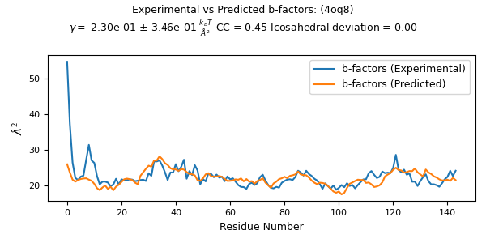
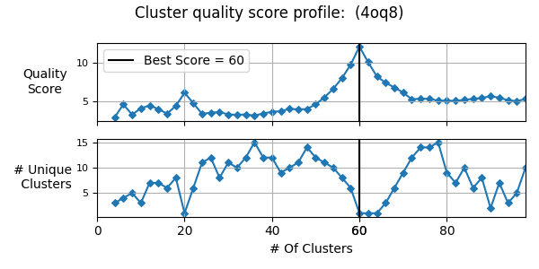
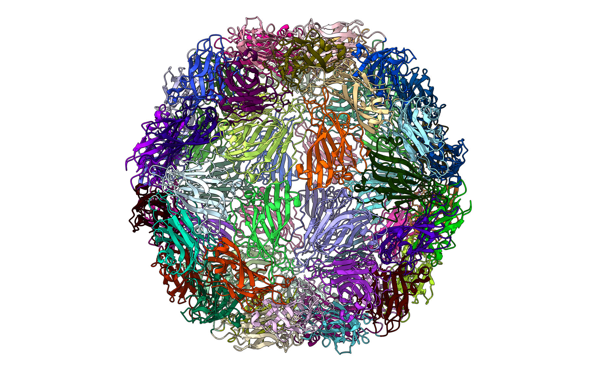
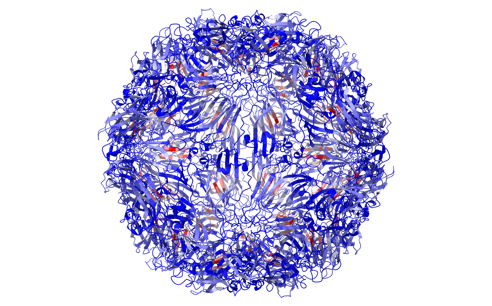
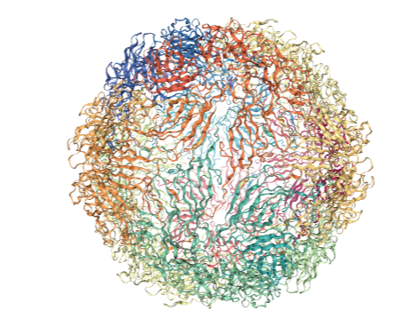
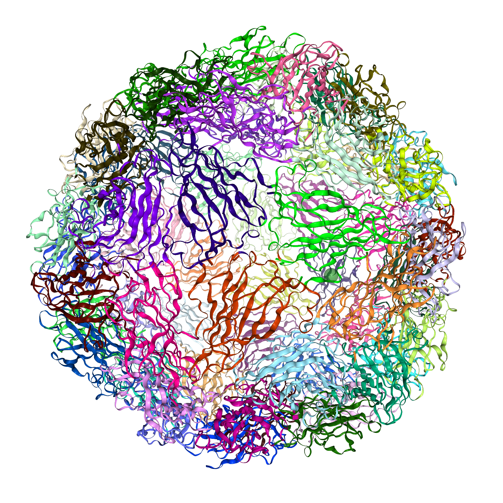
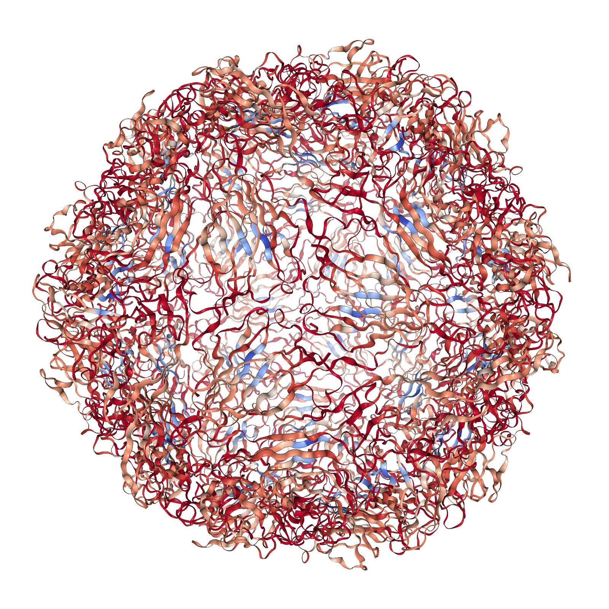

* 
{:toc}

# Running pyCapsid remotely on Google Colab
The simplest way to use pyCapsid is using this [colab notebook](https://colab.research.google.com/github/luquelab/pyCapsid/blob/main/notebooks/pyCapsid_colab_notebook.ipynb)
which runs pyCapsid on a free Google cloud-based platform in a Jupyter environment. The Colab notebook is self documenting and is designed to be simple to use. 
The Colab notebook has built in methods for visualizing the results for small 
structures using NGLView, but we recommend installing molecular visualization software 
[UCSF ChimeraX](https://luquelab.github.io/pyCapsid/installation/#visualization-in-chimerax) locally for high-quality visualizations of larger structures.
The following quick-start guide is also included in the notebook.

## Colab quick-start guide
Follow the steps described below to obtain the dominant dynamics and quasi-rigid units of a protein complex. To help navigate the guide, we recommend displaying the Colab notebook's Table of contents (open the `View` menu on the top bar and choose `Table of contents`):
1. Specify the structure to be analyzed in the [Input structure](https://colab.research.google.com/github/luquelab/pyCapsid/blob/main/notebooks/pyCapsid_colab_notebook.ipynb#scrollTo=Input_structure) section. Run the code block to set the parameters and, if not fetching a remote structure, upload the structure file.
2. Modify the default pyCapsid parameters if necessary in the [pyCapsid parameters](https://colab.research.google.com/github/luquelab/pyCapsid/blob/main/notebooks/pyCapsid_colab_notebook.ipynb#scrollTo=pyCapsid_parameters) section. Run the code block to set the parameters.
3. Execute the rest of the notebook by navigating the Colab menu `Runtime` and choosing the option `Run all` or `Run after` in the cell after the pyCapsid parameters. This will install pyCapsid, run the pipeline, and generate and store the results.
  + The pipeline will automatically compress and download the outputs in two zip files. Your browser might prompt a request to allow the downloading process. `pyCapsid_report.zip` contains key results, a report summarizing them, and instructions for visualizing the results in ChimeraX. `pyCapsid_results.zip` contains all of the relevant data files created by pyCapsid and a readme describing their contents. 
  + If you encounter any issues in the downloading process, check the section [Problems downloading results?](https://colab.research.google.com/github/luquelab/pyCapsid/blob/main/notebooks/pyCapsid_colab_notebook.ipynb#scrollTo=Problems_downloading_results_)
  + The execution time and maximum size of the protein complex depend on the computing power and memory of the Colab cloud service used, which depends on the user's Colab plan. The section [Estimate time and memory](https://colab.research.google.com/github/luquelab/pyCapsid/blob/main/notebooks/pyCapsid_colab_notebook.ipynb#scrollTo=Estimate_time_and_memory) gives an estimate of the time and memory requirements based on the number of residues in the structure.
4. Extract and read the downloaded report (`pyCapsid_report.*`) for a summary and interpretation of the main results. The report is available in three formats: Markdown, `*.md`, Microsoft Word (`*.docx`), and Web page's HyperText Markup Language (`*.html`). The multi-formatted report aims to facilitate users adapting pyCapsid's results to their publication needs. Check the section [pyCapsid report](https://colab.research.google.com/github/luquelab/pyCapsid/blob/main/notebooks/pyCapsid_colab_notebook.ipynb#scrollTo=pyCapsid_report) for further details.   
   + Additional results are displayed throughout the different subsections in the [Run the pyCapsid pipeline](https://colab.research.google.com/github/luquelab/pyCapsid/blob/main/notebooks/pyCapsid_colab_notebook.ipynb#scrollTo=Run_the_pyCapsid_pipeline)'s section.
5. The 3D images of the protein complex will be missing in `pyCapsid_report.*`. You will need to generate them using [ChimeraX](https://www.cgl.ucsf.edu/chimerax/). We recommend downloading and installing ChimeraX from [here](https://www.cgl.ucsf.edu/chimerax/download.html). To visualize the quasi-rigid domains obtained, open a new session in ChimeraX and run the following instruction in the command line to open a file browser in ChimeraX:
```
runscript browse
```
Then, inside the browser, navigate in the `pyCapsid_report/ChimeraX/` folder and open the script `chimerax_script_colab.py`. 
This will generate a 3D model of the protein complex coloring the quasi-rigid domains in ChimeraX and store snapshots in the folder
`pyCapsid_report/figures/structures/` that will be visible in the `.html` and `.md` reports. To generate an animation of the dynamics
of the lowest-frequency non-degenerate mode, start a new ChimeraX session and follow the same steps above, but opening instead the script `chimerax_script_animate_mode.py`.
6. Optionally, read the section [Generate advanced analysis](https://colab.research.google.com/github/luquelab/pyCapsid/blob/main/notebooks/pyCapsid_colab_notebook.ipynb#scrollTo=Generate_advanced_analysis) to learn how to obtain advanced analyses using results stored during the execution of the pyCapsid pipeline.

### Colab output example
An example of what the completed pyCapsid_report.md downloaded by the notebook will look like is shown [here](https://github.com/luquelab/pyCapsid/blob/main/notebooks/pyCapsid_report_example/pyCapsid_report.md).

# Locally via Jupyter Notebook
This tutorial covers the step by step use pyCapsid to identify the quasi-rigid subunits of an example capsid. This tutorial also comes
in the form of a Jupyter notebook for those who wish to run it locally.
The example notebook is also provided for local use in the [notebooks folder](https://github.com/luquelab/pyCapsid/tree/main/notebooks).

Once the package and other dependencies are [installed](https://luquelab.github.io/pyCapsid/installation/), download the 
notebook and run the following command in its directory to launch Jupyter Notebook.

~~~~
jupyter notebook
~~~~

## Fetch and load PDB
This code acquires the pdb file from the RCSB databank, loads the necessary information, and saves copies for possible use in visualization in other software.

```python
from pyCapsid.PDB import getCapsid
pdb = '4oq8'
capsid, calphas, asymmetric_unit, coords, bfactors, chain_starts, title = getCapsid(pdb)
```

## Build ENM Hessian
This code builds a hessian matrix using an elastic network model defined by the given parameters. The types of model and the meaning of the parameters are provided in the documentation.

```python
from pyCapsid.CG import buildENMPreset
kirch, hessian = buildENMPreset(coords, preset='U-ENM')
```

## Perform NMA
This code calculates the n lowest frequency modes of the system by calculating the eigenvalues and eigenvectors of the hessian matrix.

```python
from pyCapsid.NMA import modeCalc
evals, evecs = modeCalc(hessian)
```

## Predict, fit, and compare b-factors
This code uses the resulting normal modes and frequencies to predict the b-factors of each alpha carbon, fits these results to experimental values from the pdb entry, and plots the results for comparison.

```python
from pyCapsid.NMA import fitCompareBfactors
evals_scaled, evecs_scaled, cc, gamma, n_modes = fitCompareBfactors(evals, evecs, bfactors, pdb)
```

{: width="500"}

## Perform quasi-rigid cluster identification (QRC)

```python
from pyCapsid.NMA import calcDistFlucts
from pyCapsid.QRC import findQuasiRigidClusters

dist_flucts = calcDistFlucts(evals_scaled, evecs_scaled, coords)

cluster_start = 4
cluster_stop = 100
cluster_step = 2
labels, score, residue_scores  = findQuasiRigidClusters(pdb, dist_flucts, cluster_start=cluster_start, cluster_stop=cluster_stop, cluster_step=cluster_step)
```

{: width="500"}

## Visualize in ChimeraX
If ChimeraX (https://www.cgl.ucsf.edu/chimerax/download.html) is installed you may provide a path to the chimerax 
executable file to automatically visualize the results in chimerax. This is done using the runscript command in chimerax 
and this python script: (https://github.com/luquelab/pyCapsid/blob/main/src/pyCapsid/scripts/chimerax_script.py).

```python
from pyCapsid.VIS import chimeraxViz
chimeraxViz(labels, pdb, chimerax_path='C:\\Program Files\\ChimeraX\\bin')
```

{: width="500"}

Running the same code but replacing labels with residue_scores and adding rwb_scale=True visualizes the quality score of 
each residue. This is a measure of how rigid each residue is with respect to its cluster. Blue residues make up the 
cores of rigid clusters, and red residues represent borders between clusters. 

```python
from pyCapsid.VIS import chimeraxViz
chimeraxViz(residue_scores, pdb, chimerax_path='C:\\Program Files\\ChimeraX\\bin', rwb_scale=True)
```

{: width="500"}

## Visualize in Jupyter Notebook with nglview
You can visualize the results in a Jupyter notebook with nglview. The following function returns an NGLView view with the 
results colored based on cluster. See the nglview documentation for further info on how to create high quality images.
(http://nglviewer.org/nglview/release/v2.7.7/index.html)

This cell will create a standard view of the capsid, which the next cell will modify to create the final result.

```python
from pyCapsid.VIS import createCapsidView
view_clusters = createCapsidView(pdb, capsid)
view_clusters
```

{: width="500"}

Do not run this cell until the above cell has finished rendering. If the above view doesn't change coloration, 
run this cell again.


```python
from pyCapsid.VIS import createClusterRepresentation
createClusterRepresentation(pdb, labels, view_clusters)
# Add rep_type='spacefill' to represent the atoms of the capsid as spheres. This provides less information regarding the proteins but makes it easier to identify the geometry of the clusters
#createClusterRepresentation(pdb, labels, view_clusters, rep_type='spacefill')
```

This should result in the following image:
{: width="500"}

If the above view doesn't change coloration, run the cell again. In general do not run the cell until the first cell 
has finished rendering.

Once you've done this use this code to download the results

```python
view_clusters.center()
view_clusters.download_image(factor=2)
```

Running the same code but replacing labels with residue_scores and adding rwb_scale=True visualizes the quality score of
each residue. This is a measure of how rigid each residue is with respect to its cluster. Blue residues make up the cores
of rigid clusters, and red residues represent borders between clusters. 
```python
# This code adds a colorbar based on the residue scores
print('Each atom in this structure is colored according to the clustering quality score of its residue.')
import matplotlib.colorbar as colorbar
import matplotlib.pyplot as plt
from pyCapsid.VIS import clusters_colormap_hexcolor
import numpy as np
hexcolor, cmap = clusters_colormap_hexcolor(residue_scores, rwb_scale=True)
fig, ax = plt.subplots(figsize=(10, 0.5))
cb = colorbar.ColorbarBase(ax, orientation='horizontal',
                            cmap=cmap, norm=plt.Normalize(np.min(residue_scores), np.max(residue_scores)))
plt.show()

# This cell will create an empty view, which the next cell will 
# modify to create the final result.
from pyCapsid.VIS import createCapsidView
view_scores = createCapsidView(pdb, capsid)
view_scores
```
```python
from pyCapsid.VIS import createClusterRepresentation
createClusterRepresentation(pdb, residue_scores, view_scores, rwb_scale=True)
```
```python
view_scores.center()
view_scores.download_image(factor=2)
```

{: width="500"}


# Running pyCapsid using a simple config.toml file
This tutorial also has a corresponding [example notebook](https://github.com/luquelab/pyCapsid/blob/main/notebooks/pyCapsid_config_example.ipynb).
This is a simpler and faster way to run the entire pyCapsid pipeline and save the results by setting the parameters ahead
of time in a text file. To do this download [this example](https://github.com/luquelab/pyCapsid/blob/main/docs/tutorial/config_simple.toml) 
from our GitHub or copy and paste the following into a text editor and save the output as 'config.toml'

### A simple config.toml example

```toml
[PDB]
pdb = '4oq8' # PDB ID of structure
save_all_path = './4oq8/' # where to save the results

[CG]
preset = 'U-ENM' # Model Preset To Use
save_hessian = true # Whether to save the hessian matrix

[NMA]
n_modes = 200 # Number of low frequency modes to calculate
eigen_method = 'eigsh' # eigen method to use

[b_factors]
fit_modes = true # Whether to select the number of modes used to maximize correlation

[QRC]

[VIS]
method = 'chimerax'
chimerax_path = 'C:\Program Files\ChimeraX\bin\ChimeraX.exe'

[plotting]

```

Once you've created the 'config.toml' file, the following python code will run the entire pyCapsid pipeline using the
specified settings. Make sure to either run python in the same directory as the config file or properly include the
path to the file in the python code.

```python
from pyCapsid import run_capsid
run_capsid('config.toml')
```

### A more complex config.toml

```toml
[PDB]
pdb = '4oq8' # PDB ID of structure
pdbx = false
local = false
save_full_pdb = true
save_all_path = './4oq8/' # will be prepended to all other save_paths
save_pdb_path = 'pdb/'

[CG]
preset = 'U-ENM'
save_hessian = true
save_kirchhoff = true
save_cg_path = 'matrices/'

[NMA]
n_modes = 200
eigen_method = 'eigsh'
shift_invert = true
save_modes = true
save_mode_path = 'modes/'

[b_factors]
fit_modes = true
plot_modes = false
force_ico = true
ico_tol = 0.002
save_bfactors = true
save_bfactors_path = 'bfactors/'


[QRC]
cluster_start = 10
cluster_stop = 100
cluster_step = 2
cluster_method = 'discretize'
score_method = 'median'
return_type = 'final'
save_results =  true
save_results_path =  'results/'

[VIS]
chimerax_path = 'C:\Program Files\ChimeraX\bin\ChimeraX.exe'

[plotting]
suppress_plots = true
```

# Visualizing saved results
The numerical results are saved as compressed .npz files by default and can be opened and used to visualize the results 
afterwards. This includes the ability to visualize clusters that weren't the highest scoring cluster. In this example
we visualize the results of clustering the capsid into 20 clusters.

```python
from pyCapsid.VIS import visualizeSavedResults
results_file = f'4oq8_final_results_full.npz' # Path of the saved results
labels_20, view_clusters_20 = visualizeSavedResults('4oq8', results_file, n_cluster=20, method='nglview')
view_clusters_20
```

```python
from pyCapsid.VIS import createClusterRepresentation
createClusterRepresentation('4oq8', labels_20, view_clusters_20)
```

# ProDy Integration
[ProDy](http://prody.csb.pitt.edu/) is a free and open-source Python package for protein structural dynamics analysis. 
Our ENM and NMA modules make performance improvements compared to ProDy, but it still has a large number of useful 
applications of ENM/NMA results. Luckily one can make use of pyCapsids faster ENM and NMA module while still being able 
to use ProDy's other features by performing the calculations using pyCapsid and passing the results to ProDy.

```python
from prody import ANM, parsePDB
capsid = parsePDB('7kq5', biomol=True)
calphas = capsid.select('protein and name CA')
anm = ANM('T. maritima ANM analysis')

from pyCapsid.CG import buildENM
coords = calphas.getCoords()
kirch, hessian = buildENM(coords, cutoff=10)

from pyCapsid.NMA import modeCalc
evals, evecs = modeCalc(hessian)

anm._hessian = hessian
anm._array = evecs
anm._eigvals = evals
```